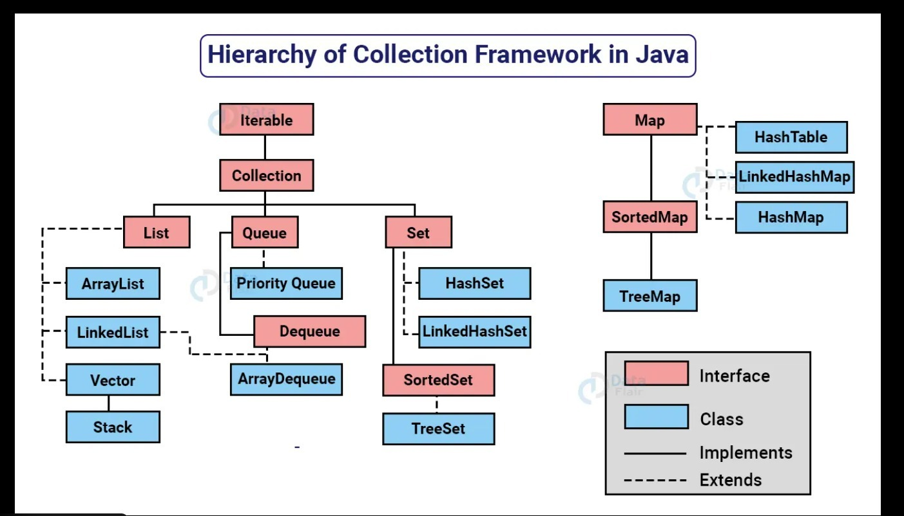

# Collection Framework

- **The problem with Array**:
  - Fixed size: Once an array is created, its size cannot be changed.
  - Homogeneous: Arrays can store elements of the same data type.
  - Less flexible: Limited built-in methods for manipulation.
  - Memory allocation: Allocated in contiguous memory locations.

---

collection framework= `collection`(Collection of groups of objects in a single unit of classes and interfaces) + `framework`(A structure that provides a standard way to build and manage collections of objects)

complete collection is present in `java.util` package.

---

### Colletion hierarchy

- **Iterable Interface**: The root interface for all collection classes. It provides the ability to iterate over a collection of objects. `(interface)`
  - **Iterator Interface**: Provides methods to iterate over a collection. `(interface)`
    - hasNext()
    - next()
    - remove()
  - **ListIterator Interface**: Extends Iterator to allow bidirectional traversal of a list. `(interface)`
    - hasPrevious()
    - previous()
    - nextIndex()
    - previousIndex()
    - set(E e)
    - add(E e)
- **Collection Interface**: The root interface in the collection hierarchy. It defines basic methods for adding, removing, and checking elements.
  - **List Interface**: An ordered collection (also known as a sequence). Allows duplicate elements.
    - **ArrayList**: A resizable array implementation of the List interface. `(class)`
    - **LinkedList**: A doubly-linked list implementation of the List interface. `(class)`
    - **Vector**: A synchronized resizable array implementation of the List interface. `(class)`
      - **Stack**: A subclass of Vector that implements a last-in-first-out (LIFO) stack of elements. `(class)`

  - **Set Interface**: A collection that does not allow duplicate elements.
    - **HashSet**: An implementation of the Set interface that uses a hash table for storage. `(class)`
    - **LinkedHashSet**: A hash table and linked list implementation of the Set interface, maintaining insertion order. `(class)`
    - **TreeSet**: A NavigableSet implementation based on a red-black tree, which sorts elements in natural order or by a specified comparator. `(class)`
  - **Queue Interface**: A collection designed for holding elements prior to processing. Typically follows FIFO (First In First Out) order.
    - **PriorityQueue**: An unbounded priority queue based on a priority heap. `(class)`
    - **Deque Interface**: A double-ended queue that allows insertion and removal of elements from both ends. `(interface)`
    - **ArrayDeque**: A resizable array implementation of the Deque interface. `(class)`



### Common Methods in Collection Interface

1. add(Object o)
2. addAll(Collection c)
3. remove(Object o)
4. removeAll(Collection c)
5. retainAll(Collection c)
6. contains(Object o)
7. containsAll(Collection c)
8. size()
9. isEmpty()
10. clear()
11. iterator()

---

### The characteristics of List Interface `Good to know`

1. List follows an insertion order.
2. List allows duplicate elements.
3. List allows random access to elements using an index.
4. List can contain null elements.

---

### The characteristics of Set Interface `Good to know`

1. Set does not allow duplicate elements.
2. Set does not guarantee any specific order of elements (except for LinkedHashSet and TreeSet).
3. Set allows null elements (except for TreeSet which does not allow null if it uses natural ordering).
4. Set does not follow indexing to access elements.

---

### Java Snippets for Common Collection Methods

**1. add(Object o)** - Adds a single element to the collection

```java
import java.util.*;

public class AddExample {
    public static void main(String[] args) {
        List list = new ArrayList();
        list.add("Apple");
        list.add("Banana");
        System.out.println(list); // [Apple, Banana]
    }
}
```

**2. addAll(Collection c)** - Adds all elements from another collection

```java
import java.util.*;

public class AddAllExample {
    public static void main(String[] args) {
        List list1 = new ArrayList();
        list1.add("Apple");
        list1.add("Banana");

        List list2 = new ArrayList();
        list2.add("Orange");
        list2.add("Mango");

        list1.addAll(list2);
        System.out.println(list1); // [Apple, Banana, Orange, Mango]
    }
}
```

**3. remove(Object o)** - Removes a single element from the collection

```java
import java.util.*;

public class RemoveExample {
    public static void main(String[] args) {
        List list = new ArrayList();
        list.add("Apple");
        list.add("Banana");
        list.add("Orange");

        list.remove("Banana");
        System.out.println(list); // [Apple, Orange]
    }
}
```

**4. removeAll(Collection c)** - Removes all elements present in another collection

```java
import java.util.*;

public class RemoveAllExample {
    public static void main(String[] args) {
        List list1 = new ArrayList();
        list1.add("Apple");
        list1.add("Banana");
        list1.add("Orange");
        list1.add("Mango");

        List list2 = new ArrayList();
        list2.add("Banana");
        list2.add("Mango");

        list1.removeAll(list2);
        System.out.println(list1); // [Apple, Orange]
    }
}
```

**5. retainAll(Collection c)** - Retains only elements present in another collection

```java
import java.util.*;

public class RetainAllExample {
    public static void main(String[] args) {
        List list1 = new ArrayList();
        list1.add("Apple");
        list1.add("Banana");
        list1.add("Orange");
        list1.add("Mango");

        List list2 = new ArrayList();
        list2.add("Banana");
        list2.add("Mango");

        list1.retainAll(list2);
        System.out.println(list1); // [Banana, Mango]
    }
}
```

**6. contains(Object o)** - Checks if collection contains a specific element

```java
import java.util.*;

public class ContainsExample {
    public static void main(String[] args) {
        List list = new ArrayList();
        list.add("Apple");
        list.add("Banana");

        boolean hasBanana = list.contains("Banana");
        boolean hasOrange = list.contains("Orange");

        System.out.println("Has Banana: " + hasBanana); // true
        System.out.println("Has Orange: " + hasOrange); // false
    }
}
```

**7. containsAll(Collection c)** - Checks if collection contains all elements from another collection

```java
import java.util.*;

public class ContainsAllExample {
    public static void main(String[] args) {
        List list1 = new ArrayList();
        list1.add("Apple");
        list1.add("Banana");
        list1.add("Orange");

        List list2 = new ArrayList();
        list2.add("Apple");
        list2.add("Banana");

        List list3 = new ArrayList();
        list3.add("Apple");
        list3.add("Mango");

        System.out.println(list1.containsAll(list2)); // true
        System.out.println(list1.containsAll(list3)); // false
    }
}
```

**8. size()** - Returns the number of elements in the collection

```java
import java.util.*;

public class SizeExample {
    public static void main(String[] args) {
        List list = new ArrayList();
        list.add("Apple");
        list.add("Banana");
        list.add("Orange");

        int size = list.size();
        System.out.println("Size: " + size); // Size: 3
    }
}
```

**9. isEmpty()** - Checks if the collection is empty

```java
import java.util.*;

public class IsEmptyExample {
    public static void main(String[] args) {
        List list1 = new ArrayList();
        List list2 = new ArrayList();
        list2.add("Apple");

        System.out.println("List1 is empty: " + list1.isEmpty()); // true
        System.out.println("List2 is empty: " + list2.isEmpty()); // false
    }
}
```

**10. clear()** - Removes all elements from the collection

```java
import java.util.*;

public class ClearExample {
    public static void main(String[] args) {
        List list = new ArrayList();
        list.add("Apple");
        list.add("Banana");
        list.add("Orange");

        System.out.println("Before clear: " + list); // [Apple, Banana, Orange]
        list.clear();
        System.out.println("After clear: " + list); // []
        System.out.println("Size: " + list.size()); // 0
    }
}
```

**11. iterator()** - Returns an iterator to traverse the collection

```java
import java.util.*;

public class IteratorExample {
    public static void main(String[] args) {
        List list = new ArrayList();
        list.add("Apple");
        list.add("Banana");
        list.add("Orange");

        Iterator iterator = list.iterator();

        System.out.println("Iterating through collection:");
        while(iterator.hasNext()) {
            String fruit = (String) iterator.next();
            System.out.println(fruit);
        }

        // Output:
        // Apple
        // Banana
        // Orange
    }
}
```

---

## How list sizes are managed internally

- **ArrayList**: Uses a dynamic array that resizes itself when it reaches capacity. When the internal array is full, a new larger array is created, and the elements are copied over.

first capacity=10  
when full new capacity= old capacity\*(3/2) + 1;

### steps to increase size in ArrayList

1. Check if the current size equals the capacity.
2. If full, create a new array with increased capacity using the formula old capacity\*(3/2) + 1.
3. Copy existing elements to the new array.
4. Add the new element to the new array.

---

## generic collection vs non-generic collection

- **Generic Collection**:
  - Type-safe: Ensures that only objects of a specified type can be added to the collection.
  - Compile-time checking: Errors are caught at compile time rather than runtime.
  - No need for casting: Elements retrieved from the collection do not require casting.
  - syntax example: 1. `List<String> list = new ArrayList<>();` 2. `List<String> list = new ArrayList<String>();`
